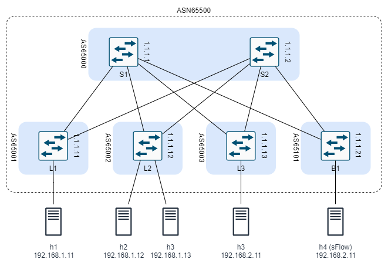
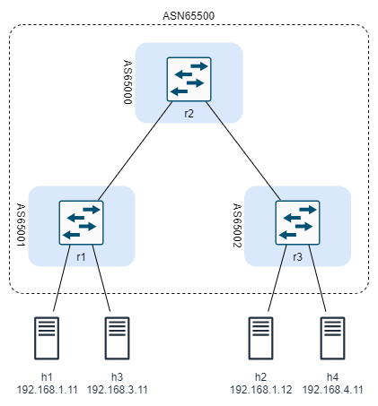

# Configuration Overview

This is still work in-progress.

## Main Lab Topology

The main clab configuration file creates a Data Centre fabric using BGP, EVPN, and VxLAN technologies. Here is a description of the overall topology:

- The DC consists of two spine switches, three leaf switches, and one border switch.
- There are five servers connected to the leaf switches as follows:
   - Server1 is connected to Leaf1
   - Server2 and Server3 are connected to Leaf2
   - Server4 is connected to Leaf3
   - Server5 is connected to Border1
- Servers 1 to 3 reside on the same subnet and the need to communicate at layer 2
- Server4 and Server5 are on separate subnets
- Server5 is designated as an sFlow server. Information about its usage will be added to the documentation later.

The goal of the configuration is to allow connectivity among all servers over the DC fabric.



## Configuration Workflow

The following is the description of the configuration procedure. The procedure is divided into three stages:

- Fabric Configuration
- EVPN Configuration
- VxLAN Configuration

Notes:

- The bgp-evpn configuration is not possible on network-instance of type default.
- the system0 interface can only be associated with network-instance default

### Fabric Configuration

Prior to configuring EVPN based overlay, a routing protocol needs to be deployed in the fabric to advertise the reachability of all the leaf VXLAN Termination End Point (VTEP) addresses throughout the IP fabric.

Therefore, we need to configure BGP between five autonomous systems (AS). One AS includes the spine switches. Each of the other ASs includes one leaf or border switch. The purpose of configure eBGP is to create an underlay infrastructure that share all *system0* (loopback) IP addresses that will be used later.

The configuration includes the following steps (order is not import as long as all steps are completed before committing the configuration):

- Define the *system0.0* interface and assign an IPv4 address:

    Switch | *system0.0* IPv4 Address
    ---|----
    S1 | 1.1.1.1
    S2 | 1.1.1.2
    L1 | 1.1.1.11
    L2 | 1.1.1.12
    L3 | 1.1.1.13
    B1 | 1.1.1.21

- Define the network interfaces for inter-switch links and assigning a /30 IP address to each:

    Link | IPv4 Subnet
    ---|---
    S1 -- L1 | 10.10.10.0/24
    S1 -- L2 | 10.10.10.4/24
    S1 -- L4 | 10.10.10.8/24
    S1 -- B1 | 10.10.10.100/24
    S2 -- L1 | 10.10.10.12/24
    S2 -- L2 | 10.10.10.16/24
    S2 -- L4 | 10.10.10.20/24
    S2 -- B1 | 10.10.10.104/24

- Define the *default* network instance and add the system and network interfaces to it.
- Configure a routing policy to allow the exchange of the above addresses.
- Configure BGP:
   - Define the local AS number:

     Switch | ASN
     ---|----
     S1 | 65000
     S2 | 65000
     L1 | 65001
     L2 | 65002
     L3 | 65003
     B1 | 65101

   - Define a peer group and assign the local ASN and routing policy to it.
   - Define all neighbours
   - on leaf switches only, enable ECMP load balancing.

At the end of this stage, you should be able to see all BGP neighbours and the advertised routes.

### EVPN Configuration

The previous configuration enables us to establish iBGP EVPN sessions between the Leaf and Spine routers. In this stage we create iBGP configuration by including all routers in one AS (65500). The configuration for all routers will be the same but spine will be used also as route reflectors.

Follow these steps in leaf and border switches:

- define a BGP group of type evpn and
  - assign it a local AS 65500.
  - assign it a transport local-address (use system0.0)
- define the two spine switches as neighbours in the peer group

In the spine switches:

- define a BGP peer-group of type evpn and
  - assign it a local AS 65500.
  - assign it a transport local-address (use system0.0)
  - define rule-reflector
- define all leaf and border switches neighbours in the peer group

### VxLAN Configuration

The configuration of VxLAN is different for each router. In summary, we will need:

- Network interfaces to servers connected to the leaf and border routers.
- A VxLAN tunnel in all leaf and border routers.
- A MAC-VRF instance configured in leaf1 and leaf2 to connect the servers attached to these leaves in one broadcast domain.
- An Integrated routing and bridging (irb) interface in leaf1 to allow inter-subnet L3 connectivity.


Server | IP Address
---|---
h1 | 192.168.1.11/24
h2 | 192.168.1.12/24
h3 | 192.168.1.13/24
h4 | 192.168.2.11/24
sflow | 192.168.3.11/24


### Verification and Troubleshooting


Ensure that a BGP session is established:

```
# /show network-instance default protocols bgp neighbor <neighbor>
```

To verify the tunnel interface configuration:

```
# /show tunnel-interface vxlan-interface brief
```

For the bridge table:

```
# /show network-instance vrf-1 bridge-table mac-table all
```

Once configured, the bgp-vpn instance can be checked to have the RT/RD values set:

```
# /show network-instance vrf-1 protocols bgp-vpn bgp-instance 1
```

When the BGP-EVPN is configured in the mac-vrf instance, the leafs start to exchange EVPN routes, which we can verify with the following commands:

```
# /show network-instance default protocols bgp neighbor <neighbor>
```

The IMET/RT3 routes can be viewed in summary and detailed modes:

```
# /show network-instance default protocols bgp routes evpn route-type 3 summary
```

```
# /show network-instance default protocols bgp routes evpn route-type 3 detail
```

When the IMET routes from leaf2 are imported for vrf-1 network-instance, the corresponding multicast VXLAN destinations are added and can be checked with the following command:

```
# show tunnel-interface vxlan1 vxlan-interface 1 bridge-table multicast-destinations destination *
```


After receiving EVPN routes from the remote leafs with VXLAN encapsulation5, SR Linux creates VXLAN tunnels towards remote VTEP, whose address is received in EVPN IMET routes. The state of a single remote VTEP we have in our lab is shown below from the leaf1 switch.

```
# /show tunnel vxlan-tunnel all
```

Once a VTEP is created in the vxlan-tunnel table with a non-zero allocated index6, an entry in the tunnel-table is also created for the tunnel.

```
# /show network-instance default tunnel-table all
```

When the leafs exchanged only EVPN IMET routes they build the BUM flooding tree (aka multicast destinations), but unicast destinations are yet unknown, which is checked with the command below:

```
# show tunnel-interface vxlan1 vxlan-interface 1 bridge-table unicast-destinations destination *
```

*Note: as of the time of this writing, you will be able to ping from h1 to h2 and h3 (on the same subnet) and from h1 to h4 and sFlow server as expected. However, ping from h2 and h3 to severs on remote subnets is not successful. I am still troubleshooting the issue.*

## Alternative Lab Topology

To be able to experiment with srlinux quickly, a smaller topology file is added. The smaller DC topology consists of one spine switch, two leaf switches, and four servers connected to the leaf switches as follows:
   - Server1 and Server3 are connected to leaf r1
   - Server2 and Server4 are connected to leaf r3
- Server1 and Server2 reside on the same subnet and the need to communicate at layer 2
- Server3 and Server4 are on separate subnets




The goal of the configuration is to allow connectivity among all servers over the DC fabric.

Similar to the main topology, the router are configured to run eBGP to create an underlay infrastructure. EVPN and VxLAN are configured using iBGP as an overlay. Unlike the main topology, route reflector is not needed for this topology.

The IP addresses of the servers:

Server | IP Address
---|---
h1 | 192.168.1.11/24
h2 | 192.168.1.12/24
h3 | 192.168.3.11/24
h4 | 192.168.4.11/24

*Note: as of the time of this writing, you will be able to ping from h1 to h2 (on the same subnet) and from h1 to h3 and h4 as expected. However, ping from h2 to h3 and h4 is not successful. I am still troubleshooting the issue.*

## References

The above configuration is based on the following tutorials:

- [Nokia Tutorial](https://learn.srlinux.dev/tutorials/)
- [Another Tutorial](https://networkcloudandeverything.com/configuring-srlinux-nodes-in-a-3-tier-data-center/)
