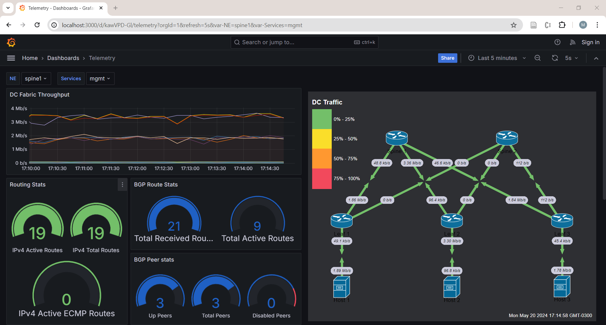

# Telemetry Collection with gNMIc

This lab demonstrates the use of gNMIc to receive telemetry from a network consists of two spine routers, three leaf routers, and three servers. All routers are Nokia srlinux.

In this lab topology, gNMIc sends the telemetry to Prometheus. Grafana visualizes the data with help of Network Weathermap plugin.

You can find more about gNMIc in my [blog post](http://adhocnode.com/introduction-to-gnmic/).



## Usage

To use this lab, deploy the topology

```
$ cd telemetry
telemetry$ sudo clab deploy
```

To create traffic in the network:

```
telemetry$ ./generate_traffic.sh start all
```

To stop the traffic generation:

```
telemetry$ ./generate_traffic.sh stop all
```


To stop the lab:

```
telemetry$ sudo destroy --cleanup
```

## Using gNMIc

To learn more about using gNMIc, review the examples provided in this [file](gnmic_examples.md). This document provides introduction to [YANG and XPATHs](../docs/yang_xpath.md).

Use this [example](ecmp_config.md) to enable ECMP in the Network.
