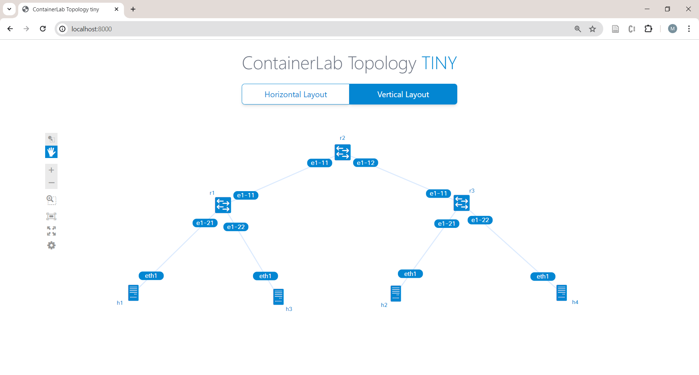

# VxLAN in a Small Topology

[](https://martimy.github.io/clab_srl_dcn)

This lab demonstrates the configuration of VxLAN in a three-router topology.

This lab uses [Release 21.11](https://documentation.nokia.com/srlinux/21-11/index.html), which is not the latest but the container size is smaller.





# Starting and stopping the lab

To start the topology:

```
$ sudo clab deploy [-t tiny.clab.yaml]
```

To stop the lab

```
$ sudo clab destroy [-t tiny.clab.yaml] [--cleanup]
```
